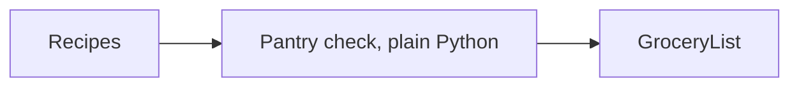

# Week of MM.DD to MM.DD: <Topic>

## Summary
Two or three sentences on what this week moved forward.

## PRs this week
| PR | What it did | State |
|---|---|---|
| [#3](link) | Adds the pantry check node | Merged |

## Session: YYYY-MM-DD
### What we worked on and why
...

### Key code
`src/agent/pantry.py`
```python
def missing_ingredients(recipe, pantry): ...
```
What it does, and why we wrote it this way instead of the alternative.

### Diagram


### Decisions and concepts
- DECISIONS #N: ...
- CONCEPTS: [term](../docs/CONCEPTS.md#term)

## What we'd explain differently next time
Optional: anything that was confusing, so we can study it.
