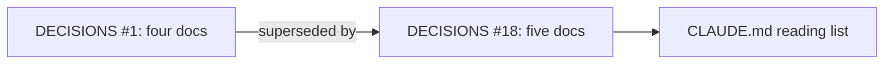
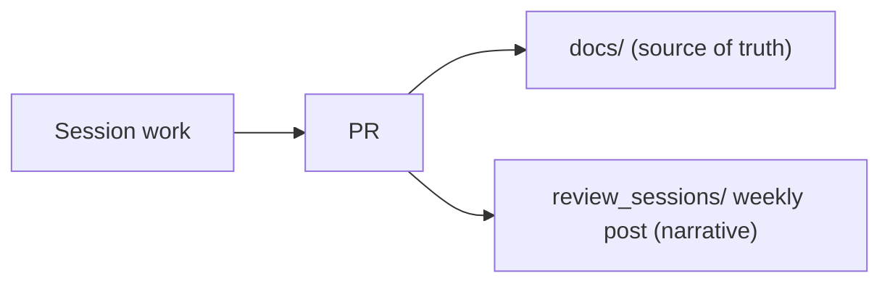
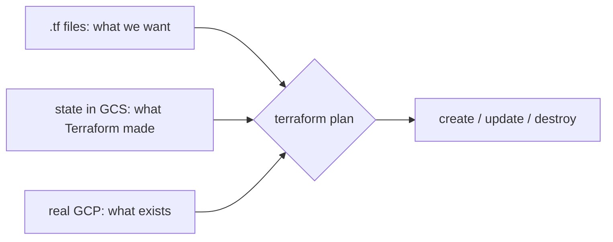
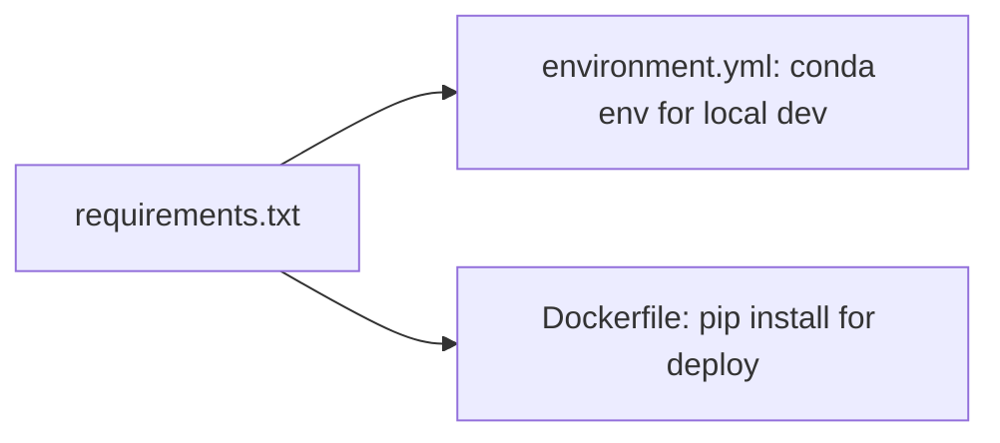
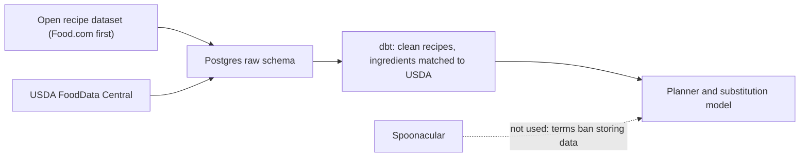

# Week of 10.07 to 10.14: Docs workflow

## Summary
No app code yet. This week set up how we document the project (CONCEPTS.md joined the source-of-truth docs, and we started these weekly review posts) and chose GCP with a Terraform scaffold under `infra/`.

## PRs this week
| PR | What it did | State |
|---|---|---|
| [#2](https://github.com/andrewtclim/meal-prep-app/pull/2) | Adds CONCEPTS.md to the source-of-truth docs (DECISIONS #18) | Merged |
| [#4](https://github.com/andrewtclim/meal-prep-app/pull/4) | Adds weekly review posts to CLAUDE.md (DECISIONS #19) | Merged |
| [#3](https://github.com/andrewtclim/meal-prep-app/pull/3) | Terraform GCP scaffold, accepts GCP (DECISIONS #10) | Merged |
| [#6](https://github.com/andrewtclim/meal-prep-app/pull/6) | Drops Spoonacular from the core build, Food.com first dataset candidate (DECISIONS #20) | Merged |
| [#7](https://github.com/andrewtclim/meal-prep-app/pull/7) | Shared conda env + requirements.txt (DECISIONS #21, proposed) | Open |

## Session: 2026-10-07
### What we worked on and why
`docs/DECISIONS.md` #1 listed four source-of-truth docs, but PR #1 had added a fifth, `CONCEPTS.md`. Because DECISIONS is append-only, we didn't edit #1. We added #18, which supersedes it, and put CONCEPTS.md on CLAUDE.md's start-of-session reading list.

### Key code
`docs/DECISIONS.md`
```markdown
### 1. Repo docs are the source of truth
- **Status:** Superseded by #18
```
Superseding instead of editing keeps the history of why we decided something. An accepted entry never changes, so a reader can trust that what it says was true when it was accepted.

### Diagram


## Session: 2026-10-08
### What we worked on and why
We wanted a readable record of each week, with the code and the reasoning behind it, so both of us can explain the project later. CLAUDE.md now asks for one post per week, Wednesday to Wednesday, in `review_sessions/`.

### Key code
`CLAUDE.md`
```markdown
6. **Write a weekly review post in `review_sessions/`.** One blog-style post per week, Wednesday to Wednesday ...
   - `review_sessions/` is a narrative log, not a source of truth. If a post disagrees with `docs/`, the docs win, and we fix the post.
```
The last line matters most. Posts describe a moment in time and will go stale, so they stay off the start-of-session reading list and never override `docs/`.

### Diagram


### Decisions and concepts
- [DECISIONS #18](../docs/DECISIONS.md): five source-of-truth docs
- [DECISIONS #19](../docs/DECISIONS.md): weekly review posts

## Session: 2026-10-07 (Terraform review)
### What we worked on and why
Reviewed Paul's PR #3 slowly so both of us can explain Terraform. The scaffold has no resources yet; it pins versions, points state at a GCS bucket, and declares inputs. Review fixes: documented the state bucket bootstrap and access in `infra/README.md`, gave DECISIONS #10 a real rationale, and tidied formatting.

### Key code
`infra/providers.tf`
```hcl
terraform {
  backend "gcs" {
    bucket = "meal-prep-app-510920-tfstate"
    prefix = "infra"
  }
}
```
State maps each resource in our code to its real GCP ID. It lives in a remote bucket, not git, because it can hold secrets in plaintext and needs locking when two people run `apply`. The bucket name is hardcoded because backend blocks are read before variables exist, and the bucket itself is created outside this config, since Terraform needs it before `init` can run.

`infra/versions.tf`
```hcl
version = "~> 6.0"
```
Pessimistic constraint: newest 6.x, never 7.0, because major versions may break our config. The lock file pins the exact version (6.50.0) and checksums, like `uv.lock`.

### Diagram


### Decisions and concepts
- [DECISIONS #10](../docs/DECISIONS.md): GCP with Cloud Run, state in GCS
- CONCEPTS: [Terraform](../docs/CONCEPTS.md#terraform)

## Session: 2026-10-08 (dev environment)
### What we worked on and why
Before writing Python we need everyone on the same interpreter and package versions. We added a conda env that both of us create from one file, with the package list kept in `requirements.txt` so the future Docker image installs the same thing.

### Key code
`environment.yml`
```yaml
dependencies:
  - python=3.12
  - pip
  - pip:
      - -r requirements.txt
```
Conda only owns the Python version. Packages come from one pip list, so local dev and Docker can't drift apart.

`requirements.txt`
```text
langgraph>=1.0,<2
dbt-postgres>=1.8,<2
```
Ranges take minor and patch fixes but block major versions, which are the ones that break code. Undecided tools (LLM SDK, tracing, embedding library) are left out until their decisions land.

### Diagram


### Decisions and concepts
- [DECISIONS #21](../docs/DECISIONS.md): conda env with a shared pip requirements file (proposed)
- CONCEPTS: [Reproducible environments](../docs/CONCEPTS.md#reproducible-environments-spec-file-vs-lock-file)

## Session: 2026-10-09 (Spoonacular terms)
### What we worked on and why
We planned to store recipe ingredients in Postgres, so we checked whether Spoonacular's terms allow it. They don't. You may keep only the recipe id, title, and image URL. Anything else can be cached for at most 1 hour, only with written permission, and the ban covers "derived, hashed, or transformed data". That rules out saving its ingredients, mapping them to USDA, or training the substitution model on them. We dropped Spoonacular from the core build and made an open recipe dataset our only recipe source. Food.com on Kaggle is the first one to investigate.

### Key code
`docs/DECISIONS.md`
```markdown
### 5. Spoonacular is query-time only
- **Status:** Superseded by #20
...
### 20. Drop Spoonacular from the core build
- **Decision:** The app doesn't depend on Spoonacular. All recipes and ingredients come from data we're allowed to store ...
```
#5 had already said "never store Spoonacular data", but it still assumed live API calls for search and substitutions. Once we saw that even a derived USDA mapping is banned, using it live meant re-fetching every recipe on each plan build, with a 50-points-a-day free quota. #20 removes it, and #5 stays visible as history.

### Diagram


### Decisions and concepts
- [DECISIONS #20](../docs/DECISIONS.md): drop Spoonacular, supersedes #5
- [DECISIONS #8](../docs/DECISIONS.md): recipe dataset, Food.com first candidate (license not confirmed yet)
- Bigger picture: **data licensing** is part of picking any data source. The interview question is "are you allowed to store and train on this data?", and you answer it by reading the terms before you design the schema.

## What we'd explain differently next time
State file vs state bucket: encryption and keeping it out of git are about the state *file*; the bucket can't live in `main.tf` because of the chicken-and-egg with `init`.
