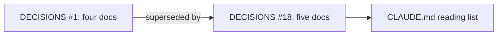
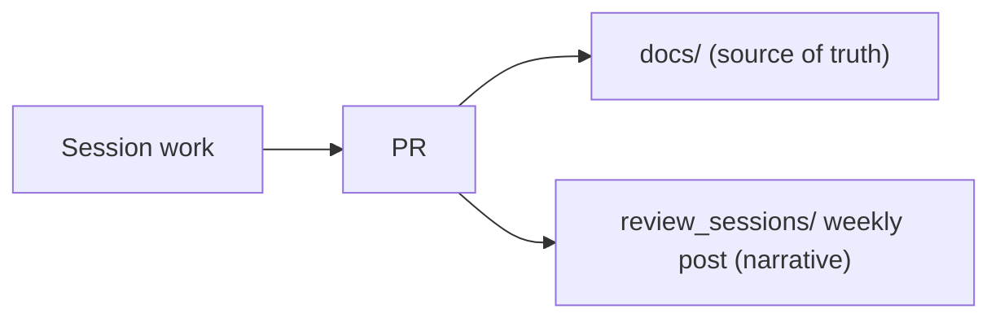

# Week of 10.07 to 10.14: Docs workflow

## Summary
No app code yet. This week set up how we document the project: CONCEPTS.md joined the source-of-truth docs, and we started these weekly review posts.

## PRs this week
| PR | What it did | State |
|---|---|---|
| [#2](https://github.com/andrewtclim/meal-prep-app/pull/2) | Adds CONCEPTS.md to the source-of-truth docs (DECISIONS #18) | Merged |
| PR_LINK | Adds weekly review posts to CLAUDE.md (DECISIONS #19) | Open |

## Session: 2026-10-07
### What we worked on and why
`docs/DECISIONS.md` #1 listed four source-of-truth docs, but PR #1 had added a fifth, `CONCEPTS.md`. Because DECISIONS is append-only, we didn't edit #1. We added #18, which supersedes it, and put CONCEPTS.md on CLAUDE.md's start-of-session reading list.

### Key code
`docs/DECISIONS.md`
```markdown
### 1. Repo docs are the source of truth
- **Status:** Superseded by #18
```
Superseding instead of editing keeps the history of why we decided something. An accepted entry never changes, so a reader can trust that what it says was true when it was accepted.

### Diagram


## Session: 2026-10-08
### What we worked on and why
We wanted a readable record of each week, with the code and the reasoning behind it, so both of us can explain the project later. CLAUDE.md now asks for one post per week, Wednesday to Wednesday, in `review_sessions/`.

### Key code
`CLAUDE.md`
```markdown
6. **Write a weekly review post in `review_sessions/`.** One blog-style post per week, Wednesday to Wednesday ...
   - `review_sessions/` is a narrative log, not a source of truth. If a post disagrees with `docs/`, the docs win, and we fix the post.
```
The last line matters most. Posts describe a moment in time and will go stale, so they stay off the start-of-session reading list and never override `docs/`.

### Diagram


### Decisions and concepts
- [DECISIONS #18](../docs/DECISIONS.md): five source-of-truth docs
- [DECISIONS #19](../docs/DECISIONS.md): weekly review posts
