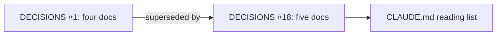
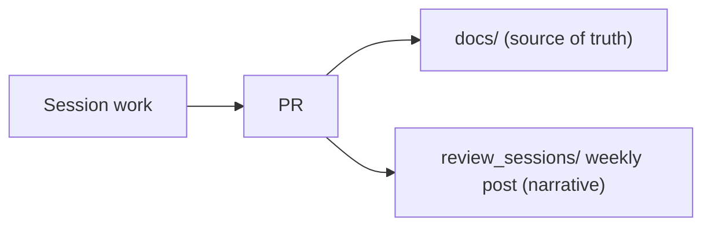
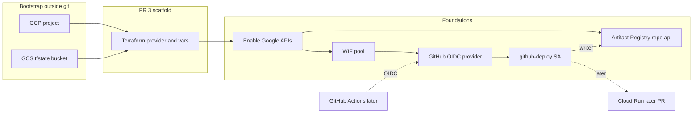

# Week of 10.07 to 10.14: Week 1 setup

## Summary
No app code yet. This week locked down how we document the project (CONCEPTS.md, weekly review posts) and stood up cloud infra: a GCP project with Terraform remote state, scaffold PR #3 for `infra/`, then foundations on `infra/gcp-foundations` (enable APIs, Artifact Registry repo `api`, GitHub Workload Identity Federation for keyless image pushes). Cloud Run and the Actions workflow are later PRs. We have not `terraform apply`’d the foundations resources yet.

## PRs this week
| PR | What it did | State |
|---|---|---|
| [#2](https://github.com/andrewtclim/meal-prep-app/pull/2) | Adds CONCEPTS.md to the source-of-truth docs (DECISIONS #18) | Merged |
| [#3](https://github.com/andrewtclim/meal-prep-app/pull/3) | Terraform GCP scaffold under `infra/`; accepts DECISIONS #10 (GCP) | Merged |
| [#4](https://github.com/andrewtclim/meal-prep-app/pull/4) | Adds weekly review posts to CLAUDE.md (DECISIONS #19) | Merged |
| (pending) `infra/gcp-foundations` | APIs, Artifact Registry, GitHub WIF, CONCEPTS, this post | Open / not pushed yet |

## Session: 2026-10-07
### What we worked on and why
`docs/DECISIONS.md` #1 listed four source-of-truth docs, but PR #1 had added a fifth, `CONCEPTS.md`. Because DECISIONS is append-only, we didn't edit #1. We added #18, which supersedes it, and put CONCEPTS.md on CLAUDE.md's start-of-session reading list.

### Key code
`docs/DECISIONS.md`
```markdown
### 1. Repo docs are the source of truth
- **Status:** Superseded by #18
```
Superseding instead of editing keeps the history of why we decided something. An accepted entry never changes, so a reader can trust that what it says was true when it was accepted.

### Diagram


## Session: 2026-10-08
### What we worked on and why
We wanted a readable record of each week, with the code and the reasoning behind it, so both of us can explain the project later. CLAUDE.md now asks for one post per week, Wednesday to Wednesday, in `review_sessions/`.

### Key code
`CLAUDE.md`
```markdown
6. **Write a weekly review post in `review_sessions/`.** One blog-style post per week, Wednesday to Wednesday ...
   - `review_sessions/` is a narrative log, not a source of truth. If a post disagrees with `docs/`, the docs win, and we fix the post.
```
The last line matters most. Posts describe a moment in time and will go stale, so they stay off the start-of-session reading list and never override `docs/`.

### Diagram


### Decisions and concepts
- [DECISIONS #18](../docs/DECISIONS.md): five source-of-truth docs
- [DECISIONS #19](../docs/DECISIONS.md): weekly review posts

## Session: 2026-10-07 (GCP and Terraform)
### What we worked on and why
Week 1 needs a cloud home before CI can deploy anything. We chose **GCP** (Cloud Run later, Artifact Registry for images) over AWS so IAM, registry, and deploy stay in one place.

Work landed in three layers:

1. **Bootstrap (outside git):** GCP project, billing, CLI auth, and a GCS bucket for Terraform state.
2. **Scaffold PR (#3):** commit the `infra/` layout (provider, variables, empty `main.tf`, lockfile) plus docs for the cloud choice. No managed resources yet — just the wiring.
3. **Foundations (branch `infra/gcp-foundations`):** enable Google APIs, create an Artifact Registry Docker repo named `api`, and set up GitHub Workload Identity Federation so a later Actions workflow can push images without a JSON key.

We used feature branches and PRs instead of committing straight to `main`, so Andrew can review infra before it becomes the shared baseline.

> The original console clicks were not written down live. The setup steps below are **reconstructed** from the project we ended up with (`meal-prep-app-510920`, bucket `meal-prep-app-510920-tfstate`, region `us-west1`). Day-to-day commands also live in [`infra/README.md`](../infra/README.md).

### How we set it up

**Tools:** [Google Cloud SDK](https://cloud.google.com/sdk/docs/install) (`gcloud`), [Terraform](https://developer.hashicorp.com/terraform/install) `>= 1.5`, a Google account that can create or use a project.

**Part A — GCP project (one-time)**

1. Create or pick a project in [Google Cloud Console](https://console.cloud.google.com/) (ours: `meal-prep-app-510920`).
2. Link **Billing**, and set a **budget alert** (Week 1 roadmap).
3. Point the CLI at the project:
```bash
gcloud auth login
gcloud auth application-default login
gcloud config set project meal-prep-app-510920
gcloud config get-value project
```
`auth login` is for CLI commands. `application-default login` is what Terraform’s Google provider uses on a laptop.
4. Pick a default region and stick to it — we use **`us-west1`** in `terraform.tfvars` and later for Artifact Registry / Cloud Run.

**Part B — Terraform remote state bucket (one-time)**

Terraform’s **state** is its memory of what it already created. We keep it in GCS so both teammates share one state file.

5. Create bucket `meal-prep-app-510920-tfstate` (names are globally unique), e.g.:
```bash
gcloud storage buckets create gs://meal-prep-app-510920-tfstate \
  --project=meal-prep-app-510920 \
  --location=us-west1 \
  --uniform-bucket-level-access
```
Optional: enable object versioning so a bad state write is recoverable.
6. Create this bucket **by hand** before `terraform init`. Chicken-and-egg: Terraform cannot create the bucket that holds its own state on the first run (unless you start local and migrate). Manual bucket is the usual shortcut.

**Part C — Terraform scaffold in the repo (PR #3)**

7. Layout under `infra/` (scaffold):

| File | Role |
|---|---|
| `versions.tf` | Terraform + Google provider version pins |
| `providers.tf` | GCS backend + `google` provider |
| `variables.tf` | `project_id`, `region` inputs |
| `terraform.tfvars` | Actual values for those inputs |
| `main.tf` | Empty at scaffold time; later resources live in focused files |
| `.terraform.lock.hcl` | Provider checksums — **commit this** |
| `.terraform/` | Local plugins/cache — **do not commit** |

8. Initialize and sanity-check:
```bash
cd infra
terraform init    # downloads provider, connects to GCS backend
terraform plan    # with empty main.tf: no changes yet
```
Nothing is created in GCP until `terraform apply`.

**Part D — Foundations (`infra/gcp-foundations`)**

9. Add `apis.tf`, `artifact_registry.tf`, `github_wif.tf`, `outputs.tf`, and `github_repository` on `variables.tf`.
10. Later PRs: Cloud Run + the Actions workflow that uses the WIF outputs. Always `plan` before `apply`, and only apply when the team agrees.

**Teammate checklist after clone:** `gcloud` auth + ADC login → set project → access to the tfstate bucket → `cd infra && terraform init` → `terraform plan` before any `apply`.

### Key code — scaffold and APIs / registry

`infra/providers.tf` (PR #3)
```hcl
terraform {
  backend "gcs" {
    bucket = "meal-prep-app-510920-tfstate"
    prefix = "infra"
  }
}
provider "google" {
  project = var.project_id
  region  = var.region
}
```
Talks to GCP in our project/region and stores **state** in GCS (not in git). `prefix = "infra"` is a path inside the bucket so later stacks can share the bucket without clobbering the same state object. Remote state is an industry pattern; the usual interview question is “how do two people apply Terraform without overwriting each other?” — shared state in object storage, with locking.

`infra/apis.tf` (foundations)
```hcl
resource "google_project_service" "services" {
  for_each = toset([
    "artifactregistry.googleapis.com",
    "iam.googleapis.com",
    "iamcredentials.googleapis.com",
    "sts.googleapis.com",
    "cloudresourcemanager.googleapis.com",
  ])
  project            = var.project_id
  service            = each.value
  disable_on_destroy = false
}
```
GCP products stay off until their API is enabled. `for_each` makes one resource per API. `disable_on_destroy = false` means removing this file later should not turn the APIs off by accident. Alternative: click Enable in the console — faster once, not reviewable, easy to drift.

`infra/artifact_registry.tf` (foundations)
```hcl
resource "google_artifact_registry_repository" "api" {
  location      = var.region
  repository_id = "api"
  format        = "DOCKER"
  depends_on    = [google_project_service.services]
}
```
Artifact Registry is our private shelf for Docker images — not the GitHub code repo. Name `api` is generic on purpose ([DECISIONS #13](../docs/DECISIONS.md)). `depends_on` enables APIs before creating the repo. Alternative: Docker Hub — extra account, weaker GCP IAM fit.

### Key code — Workload Identity Federation (detailed)

WIF is the **secure handshake**, not the full auto-deploy system.

| Piece | Role | When |
|---|---|---|
| GitHub Actions workflow | Runs on merge: build image, push, (later) deploy | Later PR |
| `github_wif.tf` | Lets that job prove “I’m our repo” and act as `github-deploy` without a JSON key | This PR |
| Artifact Registry | Stores Docker images; SA can write here | This PR |
| Cloud Run | Runs the app | Later PR |

```text
GitHub job → proves identity (OIDC) → acts as github-deploy → can push images
```

#### `variables.tf` — which GitHub repo is allowed

```hcl
variable "github_repository" {
  type        = string
  description = "GitHub repo (owner/name) allowed to deploy via Workload Identity Federation"
  default     = "andrewtclim/meal-prep-app"
}
```
One named input reused in `github_wif.tf`. Default is already our repo, so we did not duplicate it in `terraform.tfvars`.

#### `github_wif.tf` — five blocks

**Block 1 — Workload Identity pool** (trust folder for external identities)

```hcl
resource "google_iam_workload_identity_pool" "github" {
  workload_identity_pool_id = "github"
  display_name              = "GitHub Actions"
  depends_on                = [google_project_service.services]
}
```
GitHub is outside Google. The pool is where we attach external trusts. `depends_on` waits for APIs from `apis.tf`.

**Block 2 — Provider** (rules for GitHub’s badge)

```hcl
resource "google_iam_workload_identity_pool_provider" "github" {
  attribute_mapping = {
    "google.subject"       = "assertion.sub"
    "attribute.actor"      = "assertion.actor"
    "attribute.repository" = "assertion.repository"
    "attribute.ref"        = "assertion.ref"
  }
  attribute_condition = "assertion.repository == \"${var.github_repository}\""
  oidc {
    issuer_uri = "https://token.actions.githubusercontent.com"
  }
}
```
- `issuer_uri`: only trust ID tokens issued by GitHub Actions.
- `attribute_mapping`: copy useful fields off the token into GCP (repo, branch, actor).
- `attribute_condition`: reject every repo except `andrewtclim/meal-prep-app`.

**Block 3 — Service account** (robot user inside GCP)

```hcl
resource "google_service_account" "github_deploy" {
  account_id   = "github-deploy"
  display_name = "GitHub Actions deploy"
}
```
GCP permissions attach to accounts. GitHub itself is not a GCP user; this SA is the identity that will get permissions.

**Block 4 — Link GitHub repo → that SA**

```hcl
resource "google_service_account_iam_member" "github_wif" {
  service_account_id = google_service_account.github_deploy.name
  role               = "roles/iam.workloadIdentityUser"
  member             = "principalSet://iam.googleapis.com/${google_iam_workload_identity_pool.github.name}/attribute.repository/${var.github_repository}"
}
```
Jobs from our GitHub repo may **impersonate** `github-deploy`. Without this, GitHub can prove who it is but still cannot act as the robot.

**Block 5 — What the robot may do** (narrow on purpose)

```hcl
resource "google_artifact_registry_repository_iam_member" "github_deploy_writer" {
  role   = "roles/artifactregistry.writer"
  member = "serviceAccount:${google_service_account.github_deploy.email}"
}
```
`github-deploy` may push/pull images on the `api` registry. **Not** Cloud Run deploy yet — that IAM lands with the CD PR.

Story top to bottom: make a trust folder → accept only our repo’s GitHub tokens → create robot → let our repo wear the robot’s badge → let the robot write to the image shelf.

#### `outputs.tf` — phone book, not resources

Outputs do **not** create anything. After apply they print names a future Actions workflow will need (not secrets):

```hcl
output "artifact_registry_repository" { ... }           # push images here
output "github_deploy_service_account_email" { ... }  # act as this SA
output "github_wif_provider" { ... }                  # use this WIF provider
```

```bash
cd infra
terraform output   # after apply
```

Without outputs you’d copy long resource names from the GCP console by hand. With outputs, Terraform prints the sticky notes.

We have **not** run `terraform apply` for the foundations resources yet. Next checkpoint: `terraform plan`, then apply only with explicit team OK.

### Diagram


### Git habits we practiced this week
- Work on a feature branch (`infra/terraform-scaffold`, then `infra/gcp-foundations`), open a PR, merge to `main` after review.
- Uncommitted local files block `git merge` — commit or stash first.
- Merge **`origin/main`** (after `git fetch`), not a stale local `main`, so you actually get PR #3 and teammates’ commits.
- Ignore `.DS_Store`; never commit `.terraform/` or `*.tfstate`.

### Decisions and concepts
- [DECISIONS #10](../docs/DECISIONS.md): GCP Accepted (merged with PR #3)
- [DECISIONS #13](../docs/DECISIONS.md): keep the app name out of package/module (and registry) names
- [CONCEPTS: Terraform](../docs/CONCEPTS.md#terraform)
- [CONCEPTS: Artifact Registry](../docs/CONCEPTS.md#artifact-registry)
- [CONCEPTS: Workload Identity Federation](../docs/CONCEPTS.md#workload-identity-federation)

### What we'd explain differently next time
- “Repo” means two different things: the GitHub code repo vs an Artifact Registry image repo named `api`.
- WIF is the keyless ID badge; auto-deploy is the Actions workflow that will use that badge later — easy to conflate.
- Feature branches vs `main`: merge the scaffold PR before stacking too much foundations work, or accept the extra merge/rebase step.
- Put new `.tf` files next to `providers.tf` (`infra/apis.tf`), never under `.terraform/` (local cache, gitignored).
- Commit `.terraform.lock.hcl`; never commit `.terraform/` or `*.tfstate`.
- We briefly had two weekly post filenames (`docs_workflow` and `week1_setup`); prefer one post per week and rename with `git mv` when the topic shifts.
